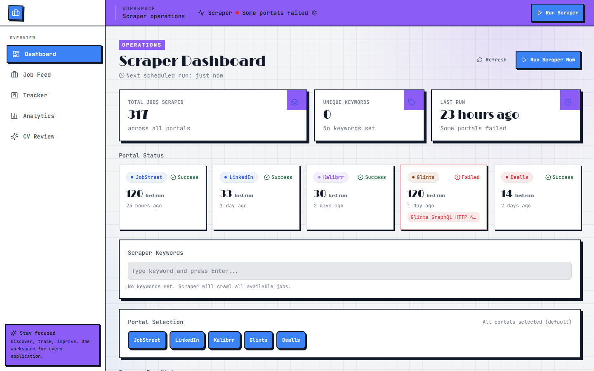
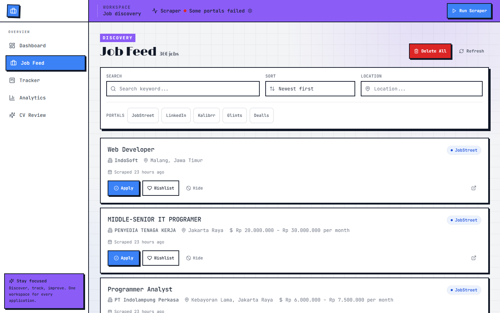
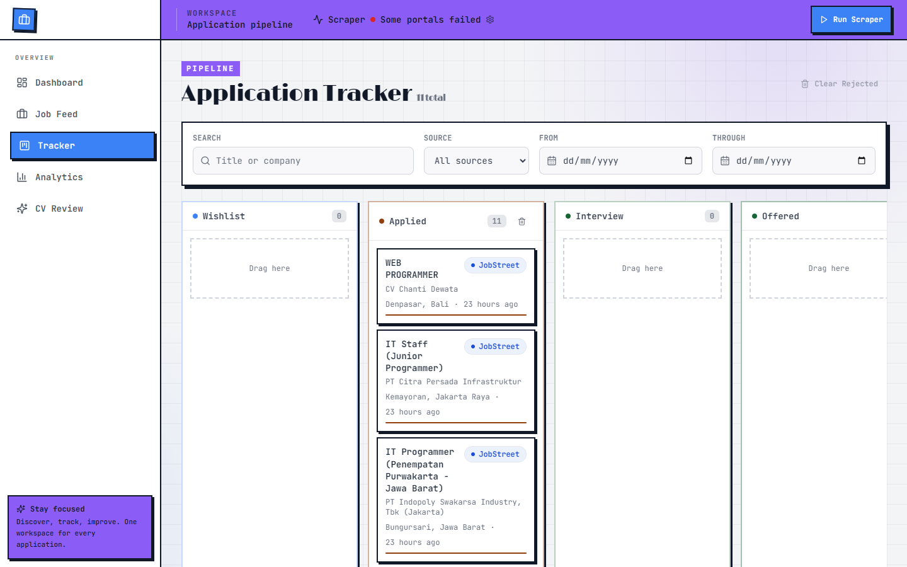
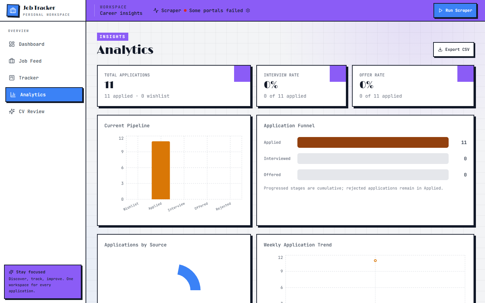
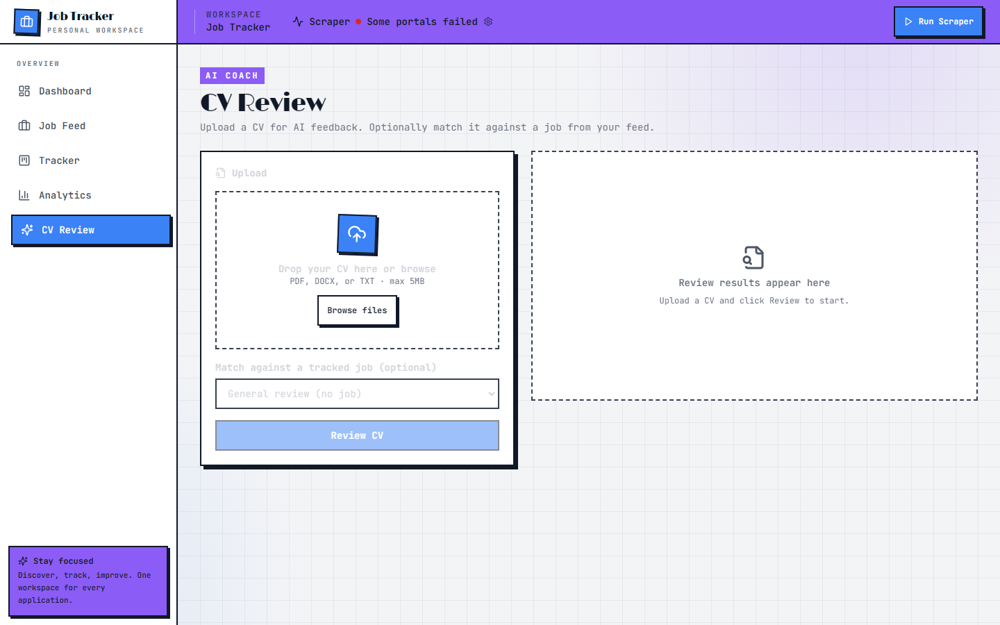

# Job Scraper & Application Tracker

Otomatisasi pencarian lowongan kerja dari 5 portal (JobStreet, LinkedIn, Kalibrr, Glints, Dealls) ke satu dasbor terpusat + sistem pelacakan lamaran (mini CRM) dengan Kanban board.

Versi 0.0.1 — personal use, single user, local only.

## Screenshot Project

### Dashboard



### Job Feed



### Application Tracker



### Analytics



### CV Review



## Fitur

- **Multi-source Scraper** — scrape 5 portal job sekaligus dengan adapter pattern. Cheerio untuk SSR, Puppeteer fallback anti-bot. Queue in-memory (`runId`, concurrency=1, max=10).
- **Deduplikasi 3-layer** — URL match → source+jobId match → weighted fuzzy match (title+company+location ≥90%).
- **Job Feed Dashboard** — filter (keyword, source, lokasi), pagination, aksi Lamar / Abaikan / Wishlist.
- **Kanban Tracker** — drag-and-drop board 5 status: wishlist → applied → interview → offered / rejected.
- **Analytics** — chart agregat (Recharts, lazy-loaded): distribusi status, tren lamaran, breakdown per source.
- **Export CSV** — export lamaran terfilter ke CSV.
- **Scheduler** — node-cron setiap 6 jam (proses terpisah).

## Tech Stack

| Layer | Teknologi |
|---|---|
| Frontend | React 18, Vite, Tailwind CSS, React Router |
| Drag-and-drop | @hello-pangea/dnd |
| Charts | Recharts (lazy chunk) |
| Backend | Node.js 20+, Express, TypeScript |
| Scraper | Cheerio (SSR) + Puppeteer (fallback), Python sidecar (hybrid, JobStreet/LinkedIn) |
| Scheduler | node-cron |
| Database | IndexedDB (UI source of truth) + SQLite (server legacy) |
| Testing | node:test via tsx, c8 coverage |

## Struktur Proyek

```
jobs/
├── src/                    # Frontend (React)
│   ├── components/
│   ├── pages/              # Dashboard, Feed, Tracker, Analytics
│   ├── hooks/
│   ├── lib/
│   └── types/
├── server/
│   ├── api/src/            # Express API + routes
│   ├── db/src/             # Drizzle schema, migrasi, queries
│   ├── scraper/src/        # Adapter per portal + orchestrator + dedup
│   └── shared/src/         # Shared types & constants
├── docs/                   # RUNBOOK, CONTRIBUTING
├── data/                   # SQLite database file
└── .env.example
```

## Prasyarat

- Node.js 20+
- npm 10+
- Puppeteer menginstall Chromium saat `npm install`
- Python (opsional, untuk hybrid scraper experiment)

## Instalasi

```bash
npm install
npm run db:migrate
npm run db:seed
```

Salin `.env.example` ke `.env`. Default sudah cukup untuk lokal:

```env
PORT=3001
HOST=127.0.0.1
DB_PATH=./data/jobs.db
SCRAPER_CRON=0 */6 * * *
VITE_API_URL=http://localhost:3001/api
```

## Menjalankan

**Frontend + API bersamaan:**

```bash
npm run dev:all
```

Frontend: http://localhost:5173 — API: http://127.0.0.1:3001

**Scraper scheduler (terminal terpisah, opsional):**

```bash
npm run dev:scraper
```

> Catatan: UI trigger scrape via `POST /api/scraper/run` (queue). Scheduler cron terpisah hanya untuk mode CLI; cron tidak mengisi client IndexedDB — gunakan trigger manual dari UI untuk mengisi data dashboard.

**Scrape sekali:**

```bash
npm run scrape:once
```

**Cek health:**

```bash
curl http://127.0.0.1:3001/api/health
```

## API Endpoints

| Method | Path | Deskripsi |
|---|---|---|
| `GET` | `/api/health` | Health check |
| `GET` | `/api/jobs` | List lowongan (filter, pagination) |
| `POST` | `/api/jobs/:id/hide` | Sembunyikan lowongan |
| `POST` | `/api/jobs/:id/unhide` | Pulihkan lowongan |
| `POST` | `/api/jobs/:id/track` | Pindah ke tracker (wishlist/applied) |
| `DELETE` | `/api/jobs` | Hapus semua lowongan + lamaran terkait |
| `GET` | `/api/applications` | List lamaran (for Kanban) |
| `PATCH` | `/api/applications/:id` | Update status/notes |
| `DELETE` | `/api/applications/:id` | Hapus satu lamaran |
| `DELETE` | `/api/applications?status=…` | Hapus lamaran by status |
| `GET` | `/api/analytics` | Data agregat untuk charts |
| `POST` | `/api/export` | Export CSV |
| `GET` | `/api/scraper/status` | Snapshot queue (portals kosong, client baca dari IndexedDB) |
| `POST` | `/api/scraper/run` | Enqueue scrape (202 + runId) atau 429 QUEUE_FULL |
| `GET` | `/api/scraper/runs/:runId` | Poll status/result run (TTL 15m) |

## Database

**Client IndexedDB** (`src/lib/idb.ts`) — source of truth UI. 3 object store:

- **jobs** — lowongan hasil scrape (title, company, location, url, salary, source, job_id, posted_at, hidden)
- **applications** — lamaran terlacak (job_id, status, notes, status_updated_at, applied_at)
- **scraper_logs** — log per scrape run (source, status, error_message, jobs_scraped_count, timestamp)

Dedup 3-layer saat ingest: URL match → (source, job_id) match → fuzzy (title+company+location ≥90%).

**Server SQLite** (`./data/jobs.db`) — legacy server-side queries (Drizzle). Scraper queue tidak insert ke SQLite; hasil run dipegang in-memory lalu di-ingest client ke IndexedDB.

Status lamaran: `wishlist` → `applied` → `interview` → `offered` / `rejected`.

## Testing

```bash
npm test                    # node:test via tsx
npm run test:coverage       # c8 coverage (35% per-file gate)
npm run typecheck           # tsc --noEmit
npm run lint                # ESLint
npm run build               # tsc -b && vite build
```

## Batasan

- No auth — localhost only, bind 127.0.0.1
- No multi-user
- No cloud deployment
- No auto-apply (FR-8, Won't Have di v1)
- No real-time notifications
